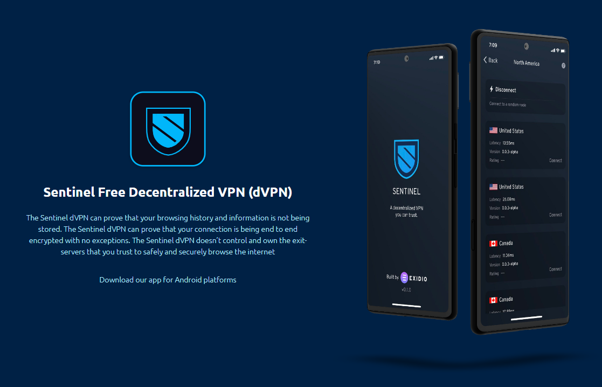

# Oraichain

## Oraichain

Oraichain is an oracle platform for connecting smart contracts to artificial intelligence.

Blockchain and smart contracts on it work on-chain and have no access to information from the outside. Oracles _are platforms that connect the blockchain to external systems, thereby allowing smart contracts to receive information from the outside as well as transmit data._

Read more about oracles at Binance Academy. Link [here](https://academy.binance.com/ru/articles/blockchain-oracles-explained)

Here's an excerpt from [press release](https://www.bloomberg.com/press-releases/2022-03-24/oraichain-launches-mainnet-2-0-to-boost-scalability-enable-mass-adoption-of-ai-in-the-blockchain-ecosystem) Orai Mainnet 2.0 on Bloomberg

Oraichain Mainnet 2.0 is a major update that paves the way for mass adoption of artificial intelligence and interoperability with other blockchains. It provides greater interoperability (\*the same interoperability that every zone in the cosmos has\_) through retransmission protocols, bridges, and IBC in CosmosSDK-based networks, creating AI L1 for dApps.

### **The problem of compatibility of artificial intelligence and smart contracts**

AI models use complex learning methods ([support vector method](https://en.wikipedia.org/wiki/Support-vector\_machine), [supervised learning](https://en.wikipedia.org/wiki/Supervised\_learning), neural networks, clustering. Therefore, smart contracts cannot run AI models in code, and it is very difficult to integrate an AI model into a smart contract. The point is three characteristics of smart contracts:

* Strictness: smart contracts always follow strict rules in which input data must be 100% accurate (e.g., signature -- either there or not) to generate output data. However, AI models cannot yet provide such accuracy (facial recognition is a good example).
* Environment: Smart contracts are mostly written in high-level programming languages such as Solidity and Rust, which provide more rigorous syntax and better security. However, AI models are usually written in Python or R.
* Data size: Smart contracts usually have relatively small storage because it helps reduce transaction fees, such as in Ethereum. That said, artificial intelligence systems are usually very voluminous.

### **How it works**.

First, let me remind you how oracle in blockchain works: a user initiates a contract execution, which he-chain refers to the oracle contract. That in turn refers to the server (already off-chain) connected to the outside world. Then in reverse order.

<figure><figcaption></figcaption></figure>

For a better understanding of oracles, we recommend that you read the translation of the article with a breakdown of the various solutions that oracles use. Here is the link [here.](https://telegra.ph/Orakuly-razbor-reshenij-predostvlyayushchih-dannye-v-blokchejn-05-25)

The AI API query process is shown in the figure with an overview of the Oraichain system. To make a request, users or smart contracts need to call the oracle script, which is available on the ORAI gateway or trading floor. The oracle script has AI data sources (provided by AI vendors), test cases, a test source (optional), and a transaction fee for each request. When a request arrives, a random willing validator is selected to perform that request. The selected validator will retrieve data from one or more AI vendors on behalf of the user after running test cases, and if the AI vendor fails the test case, the request is cancelled.

A request is considered successful if its result is written to the Oraichain blockchain. The result of the transaction, which can be obtained from smart contracts and normal applications, is a proof of execution, and charges are applied to that transaction. Reading Oraichain transaction results incurs overhead, but it helps ensure good quality AI APIs and no data tampering in the process of getting data from AI vendors.

Compared to Band Protocol and Chainlink, test cases based on API testing are a unique functionality. Because Oraichain focuses on AI APIs, testing is very important for quality control of AI vendors. In addition, test vendors can offer suitable test cases that users can choose to test AI APIs. Test cases in the Oraichain marketplace can encourage AI vendors to improve the accuracy of AI models.

Another interesting feature is that the Oraichain community has the right to rate the reputation of validators for quality improvements in AI APIs. If a validator has bad behavior, such as failure to run test cases and verify AI vendors, slow response times, and low availability, its storage token will be cut.

However, validators in Oraichain are responsible for many important tasks and can be a centralized point. Therefore, the number of selected validators must be high to improve query performance, scalability and availability. Meanwhile, since we need many validators to participate in the Oraichain network and maintain their quality performance, blockchain fees and transaction fees should be charged for these validators to earn more ORAI tokens.

### **$ORAI**

The first thing to know is that ORAI exists in three networks: Ethereum, Binance Smart Chain, and Oraichain. The tokenomics are very confusing, which leads to some thoughts.

The current version has a maximum supply of **19,779,272 ORAI,** the original sapply was 86000000. There were three burnouts:

1. December 22, 2020 burned 73% of all sappley: [https://medium.com/oraichain/oraichain-tokenomics-v3-73-token-burn-and-key-updates-4e99d1972bcf](https://medium.com/oraichain/oraichain-tokenomics-v3-73-token-burn-and-key-updates-4e99d1972bcf)

2\. On March 28, 2021, 258,449 ORAI that belonged to the team were burned (a broad gesture of course, but that's 1% of the current supply at the time).

[https://etherscan.io/tx/0xa66c06593dc8559f565e4a480c32c698ccbb128c49404f8a07a203a5f37902e1](https://etherscan.io/tx/0xa66c06593dc8559f565e4a480c32c698ccbb128c49404f8a07a203a5f37902e1)

3\. Third burn on June 23, 2021, tokens from the team, advisors, and foundation left the furnace. 3 million were burned. [https://etherscan.io/tx/0x953694d378f036ff0e136441e78875ae241d9f212b583007eb4814bab64cf7e3](https://etherscan.io/tx/0x953694d378f036ff0e136441e78875ae241d9f212b583007eb4814bab64cf7e3)

With the fireplace being melted three times, the graph over the entire time looks cool:

The current distribution of $ORAI is as follows:

The idea with almost 30% in the hands of the team doesn't seem like a good idea, but I don't insist on an objective assessment:)

The token has standard utility for the space:

1. Stacking: validators on the Oraichain network must zastak ORAI in order to be selected to create blocks or perform data requests from AI vendors;
2. Transaction fees: ORAI tokens are required as a way to pay for oracle and AI services;
3. Participation in management: Oraichain management will eventually be taken over by the DAO, with ORAI token holders voting for protocol updates and parameter changes.

Separately, I will say that the APR for ORAI stacking is now about 29%, which, imo, seems presumptuous given the circulating supply of about 2.5 million ORAIs and plans to issue 100% by 2027.

### **Dashboard**

You can't steak ORAI through Keplr wallet or Keplr-dashboard, the zone is not there. However, Oraichain has its own \[dashboard] (https://scan.orai.io/), combined with havernance, transaction scanner, IBC card.

You will need it if you decide to delegate your Orai, or get involved in management. You can also find channel numbers here to manually add to Keplr to transfer tokens between zones.

### **OraiDEX**

On March 24, 2022, together with Mainnet 2.0, OraiDEX, a decentralized exchange based on CosmWasm, was launched.

Its functionality is:

1. Moving tokens between Ethereum, BSC and the Cosmos ecosystem;
2. exchange. Naturally easy and simple, well, and high APR. The previous post is not the author's sarcasm, but a somewhat loose interpretation of the press release;
3. IBC integration. It will allow to move ORAI, ATOM, OSMO, as well as gems: LUNA, UST and CRO! (I'm already rofling about gems here, yes);
4. NFT bridge: it will be possible to move NFT between networks, for example from Oraichain to Ethereum or Binance Smart Chain. The feature is not available right now.

Now a little bit about personal experience. It is indeed possible to move tokens between BSC and Cosmos, as well as to swap them. Ethereum is not available yet. I should note that it is possible to take USDT from BSC to Oraichain, swap it there to $Atom and output via bridge to CosmosHUB - this is the third option of decentralized entry to Cosmos

* Option #1 (EVMOS, **careful!**): https://teletype.in/@creeptah/evm\_to\_cosmos
* Option #2 (Axelar): https://teletype.in/@creeptah/evm\_to\_cosmos\_2
* Option #3 (ORAI): https://teletype.in/feed/@creeptah/BSCtoCosmos

By the way, at [https://info.oraidex.io/tokens](https://info.oraidex.io/tokens) you can see the volume of trading and estimate the volume of liquidity.

OraiDEX also has its own token, OraiX, which was launched on June 22, 2022 and was selling for $0.01. The current price is 0.007414.

Utilities: meta-stacking fees (taken from profits), pooling fees, OraiBridge and NFT bridge fees, and airdrop ticket purchases for new NFT projects. Total sapply is 1 billion ORAIX, 30% will go to revards for steaking+airdrop, 50% in liquor vendor bonuses, 15% developer pool, and 5% community. Vesting for all but the community is 5 years.

The 117000000 ORAIX is split between OSMO, ATOM, JUNO and ORAI, KWT and MILKY stackers, as is customary at Cosmos. Check and see if you're entitled to something.[😋](https://getemoji.com/): [https://oraidex.io/claim-oraix](https://oraidex.io/claim-oraix)

### **WTF VRF**

Obtaining a random number is one of the hard problems in programming. You have to write code that would generate a random number...but then the number would be obtained by an algorithm, which means it's not random? That's why there are random number generators, which are widely used in cryptography as well. It is impossible to check the validity of the result, so they invented verifiable random function (VRF - variable random function). The point is that a randomly generated number can be checked for plausibility, eliminating, for example, fudging in a lampa drop with 10,000,000 participants.

Each validator has its own public key, which is used to generate a collective group signature. Similarly, a group signature is generated to confirm the creation of a random value or set of values.

I won't dive too far, but know that Oraichain believes that rollers can be compromised and then the group signature will be compromised and a random number will be generated non-randomly. That's why they developed VRF v.2, which you can read more about here [https://docs.orai.io/vrf/introduction](https://docs.orai.io/vrf/introduction)

Oraichain is competing with Chainlink in this field, so if VRF v2 makes sense, then Oraichain is a gem;) DYOR

Oraichain has already launched contracts to generate random numbers via VRF 2.0 for Fantom, Avalanche and Binance Smart Chain.

### **Ecosystem**

There aren't many dApps right now, I'll list the ones that catch my eye.

#### **yAI.Finance**

[yAI.Finance](https://yai.finance/) - is a farming aggregator based on artificial intelligence. Yeah, now you can justify your rektas with dumb artificial intelligence. APY doesn't look juicy, but maybe I didn't get in deep enough)

#### **Ai.Right**

[aiRight](https://airight.io/) - NFT Marketplace is based on... Yes, it's all based on it. The trick is that the uniqueness of the jpeg is judged by artificial intelligence (solana minter or something?).

#### **Dino Hub**

I liked this one the best. [Dino Hub](http://dinohub.io/) (formerly called Oraichain Data Hub) is a decentralized data storage and partitioning platform. What this means is that if you have raw (unprocessed data), you can upload a raw dataset, charge a premium for markup, and users will do everything (and make money from it). The processed data can be sold. This is also where test cases are created for AI vendors.

All in all, I recommend poking the buttons here - no golden mountains are promised, but the experience is fun.

### **Overall impression**.

Oraichain is more of a foundation than an area. Tokenomics and roadmap change every year, a lot of AI-based directions revolving around oracle with VRF and API AI integration. That said, Oraichain doesn't really relate to space at all. They are tightly aligned with Avalanche, Fantom, and BSC, and they call Chainlink their competitor in the blogs. In the ecosystem, for example, they named Trava, a Fantom/Avalanche/BSC tinkerer. About Cosmos, IBC with CosmosHUB and Osmosis is the only OraiDEX.

If they do not forget to pump the oracle, then perhaps something will come out.

### **Links**

**Official docs:**

[https://docs.orai.io](https://docs.orai.io/readme/decentralized-validator-sampling)

**OraiChain's Medium:**

[https://oraichain.medium.com/](https://oraichain.medium.com/)

**Actual roadmap (2022):**

[https://orai.io/roadmap](https://orai.io/roadmap)

**Articles:**

[https://morioh.com/p/100f231834f5](https://morioh.com/p/100f231834f5)

[https://www.bloomberg.com/press-releases/2022-03-24/oraichain-launches-mainnet-2-0-to-boost-scalability-enable-mass-adoption-of-ai-in-the-blockchain-ecosystem](https://www.bloomberg.com/press-releases/2022-03-24/oraichain-launches-mainnet-2-0-to-boost-scalability-enable-mass-adoption-of-ai-in-the-blockchain-ecosystem)
